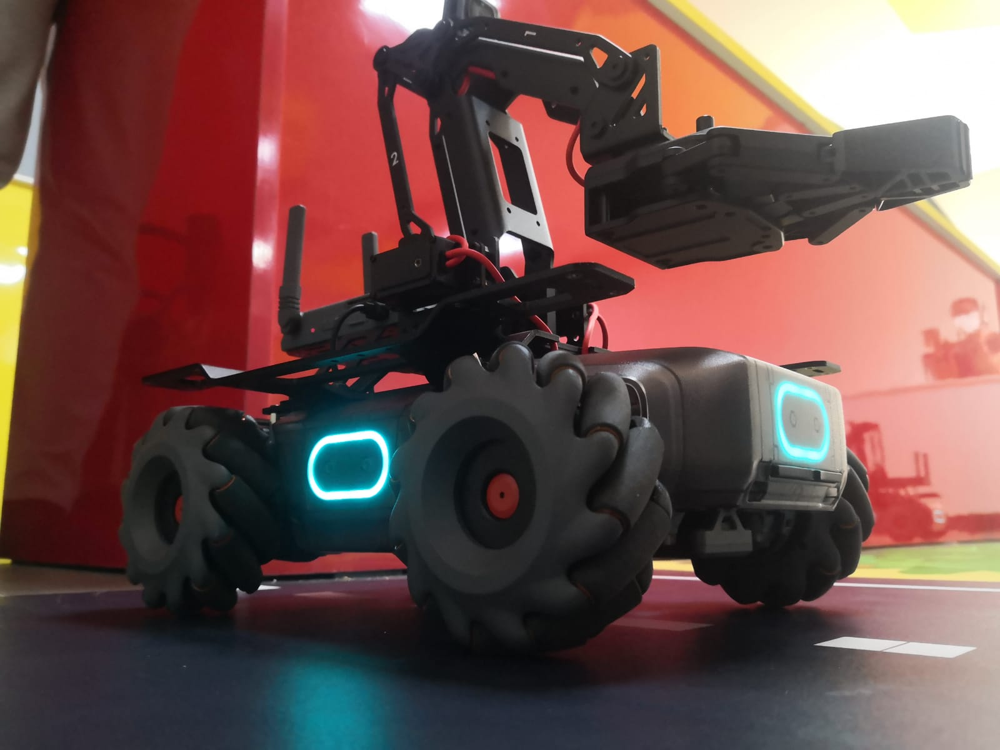

# MobileRobot-Openloopcontrol
## Aim:

To develop a python control code to move the mobilerobot along the predefined path.

## Equipments Required:
1. RoboMaster EP core
2. Python 3.7

## Procedure

Step1: Initiate the MobileRobot.

Step2: Connect your PC with the MobileRobot.

Step3: Open Python program.

Step4: Program the movements of the robot using python code.

Step5: Execute the python program.

## Program
~~~
python
from robomaster import robot
import time

if __name__ == '__main__':
    ep_robot = robot.Robot()
    ep_robot.initialize(conn_type="ap")

    ep_chassis = ep_robot.chassis

    ## Write your code here
from robomaster import robot
import time

if _name_ == '_main_':
    ep_robot = robot.Robot()
    ep_robot.initialize(conn_type="ap")

    ep_chassis = ep_robot.chassis
    ep_chassis.move(x=3, y=0, z=0, xy_speed=.75).wait_for_completed()

    ep_chassis.move(x=0, y=0, z=45, xy_speed=0.75).wait_for_completed()

    ep_chassis.move(x=3, y=0, z=0, xy_speed=0.75).wait_for_completed()
    
    ep_chassis.move(x=0, y=0, z=45, xy_speed=0.75).wait_for_completed()
    ep_chassis.move(x=1, y=0, z=0, xy_speed=0.75).wait_for_completed()
    ep_chassis.move(x=0, y=0, z=45, xy_speed=0.75).wait_for_completed()
    ep_chassis.move(x=1.5, y=0, z=0, xy_speed=0.75).wait_for_completed()
    ep_chassis.move(x=0, y=0, z=45, xy_speed=0.75).wait_for_completed()
    ep_chassis.move(x=0.8, y=0, z=0, xy_speed=0.75).wait_for_completed()
    ep_chassis.move(x=0, y=0, z=45, xy_speed=0.75).wait_for_completed()
    ep_chassis.move(x=0.9, y=0, z=0, xy_speed=0.75).wait_for_completed()


    ep_robot.close()
~~~
## MobileRobot Movement Image:


Insert image here


<br/>
<br/>
<br/>
<br/>

## MobileRobot Movement Video:

Embed video here
(https://www.youtube.com/watch?v=2qwsmqQ8a4w)
<br/>
<br/>
<br/>
<br/>

## Result:
Thus the python program code is developed to move the mobilerobot in the predefined path.


<br/>
<br/>

```
Mobile Robotics Laboratory
Department of Artificial Intelligence and Data Science/ Machine Learning
Saveetha Engineering College
```
